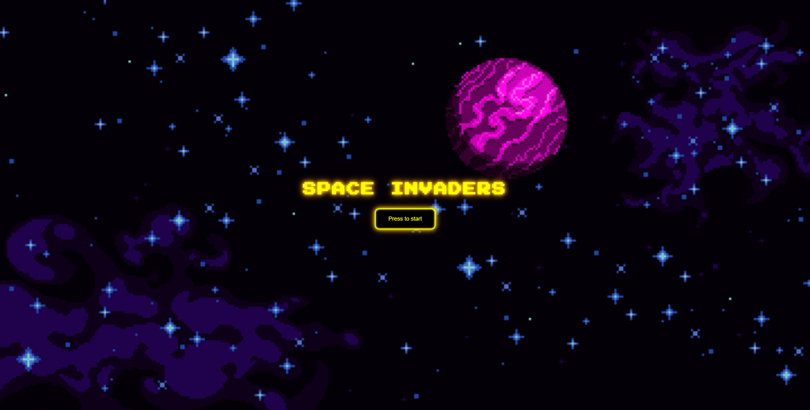
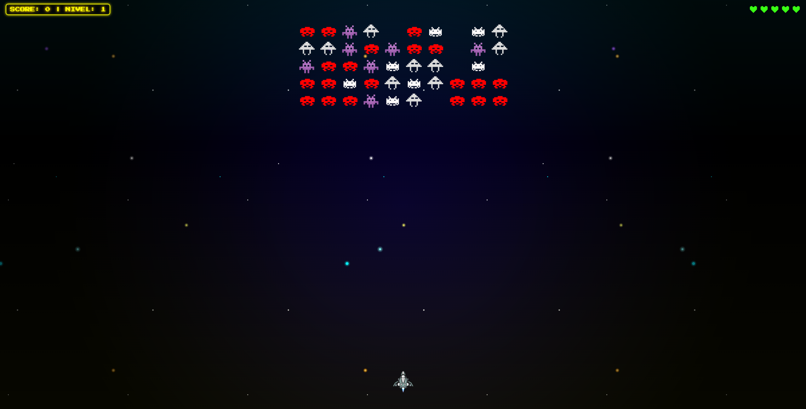
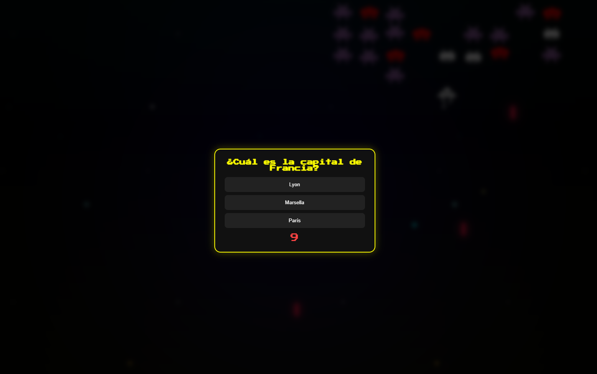
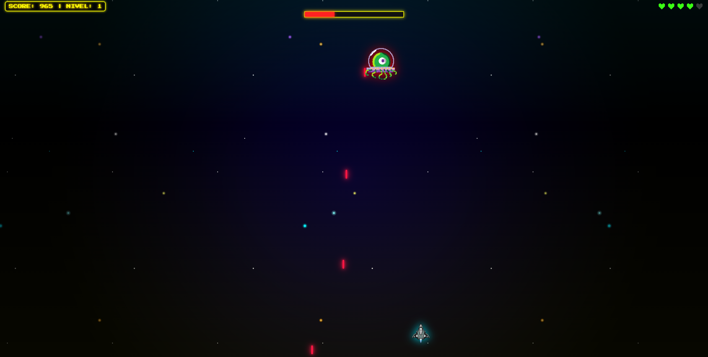
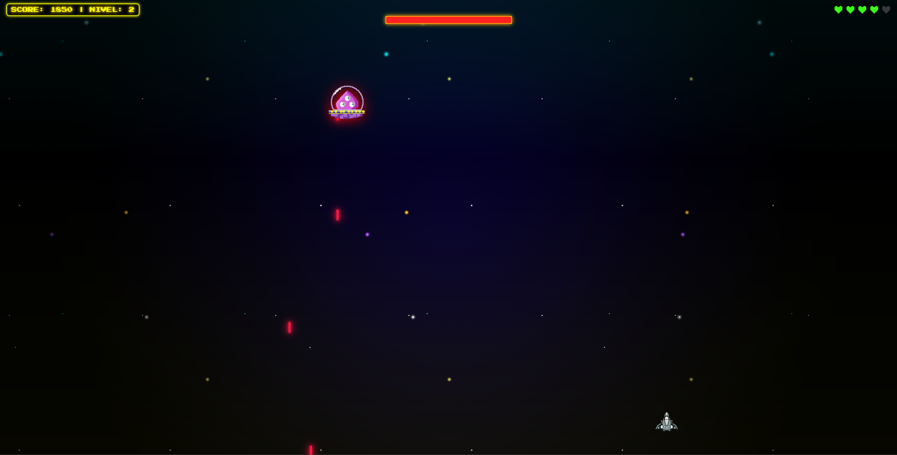
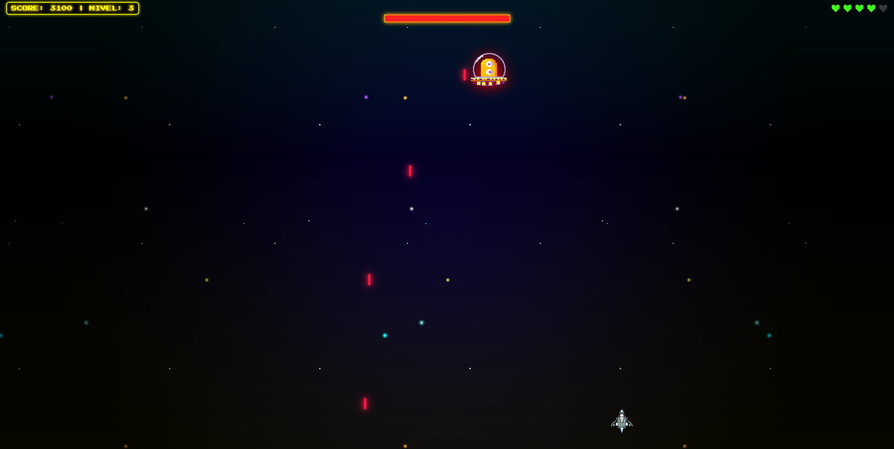
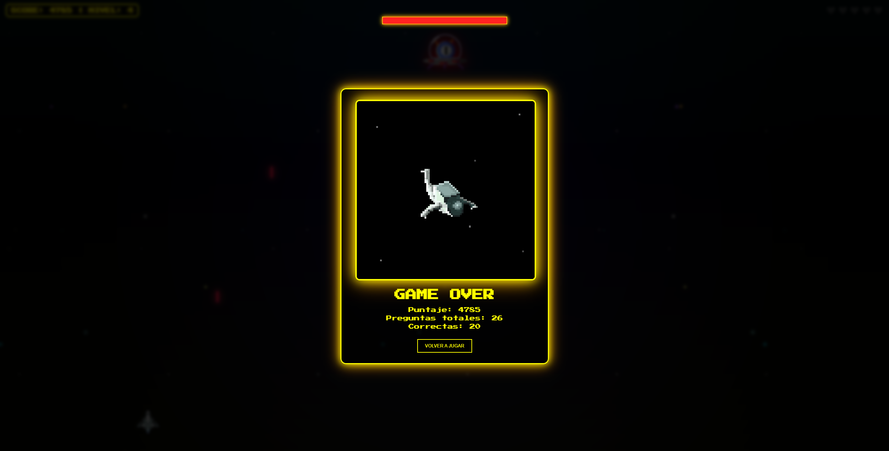

# Space Invaders – Quiz

[]()
[]()
[]()
[]()

---

## Demo en vivo

https://space-invaders-v2.vercel.app

---

## Descripción

Space Invaders – Quiz Edition es un videojuego web desarrollado en JavaScript que combina mecánicas arcade con un sistema de preguntas interactivas. El jugador avanza por niveles eliminando enemigos y enfrentando bosses, obteniendo ventajas mediante la resolución correcta de preguntas.

El sistema se ejecuta completamente en el navegador, sin necesidad de backend.

---
---

## Capturas del juego

<p align="center">
  
  
</p>

<p align="center">
  
  
</p>

<p align="center">
  
  
</p>

<p align="center">
  
</p>

---
## Características

- Niveles progresivos con dificultad incremental
- Enemigos con movimiento dinámico
- Boss al final de cada nivel con barra de vida
- Sistema de vidas del jugador
- Boosts interactivos vinculados a preguntas
- Banco de preguntas en JSON sin repetición inmediata
- Pausa del juego durante el quiz
- Pantallas de victoria y derrota con estadísticas
- Integración de audio y efectos visuales
- Interfaz estilo retro (pixel art)

---

## Tecnologías

- HTML5
- CSS3
- JavaScript (Vanilla)
- JSON
- Git / GitHub
- Vercel

Recursos multimedia obtenidos de plataformas libres de derechos.

---

## Ejecución local

### Método recomendado (Visual Studio Code)

1. Abrir el proyecto en Visual Studio Code.
2. Instalar la extensión **Live Server**.
3. Ejecutar `index.html` con:

```text
Open with Live Server
```

---

### Método alternativo (Python)

Desde la carpeta del proyecto:

```bash
python -m http.server
```

Abrir en navegador:

```text
http://localhost:8000
```

### Nota importante

No abrir el archivo con doble clic (`file://`), ya que el archivo `preguntas.json` no se cargará correctamente.

---

## Estructura del proyecto

```text
space-invaders/
│
├── index.html
├── style.css
├── script.js
├── preguntas.json
│
├── imgs/
└── audios/
```

---

## Testing

El sistema fue validado mediante casos de prueba funcionales que cubren:

- Control del jugador
- Sistema de disparo
- Movimiento de enemigos
- Colisiones y puntuación
- Activación de bosses
- Sistema de preguntas
- Gestión de vidas

### Defecto detectado

- Tirón visual al generarse un boost (impacto menor)

---

## Despliegue

El proyecto se encuentra desplegado en Vercel mediante integración con GitHub, sin necesidad de configuración de build.

---

## Estado del proyecto

- Funcional
- Estable
- Validado
- Listo para entrega

---

## Mejoras futuras

- Optimización del renderizado
- Mejora completa de responsividad
- Eliminación del tirón en boost
- Modularización del código
